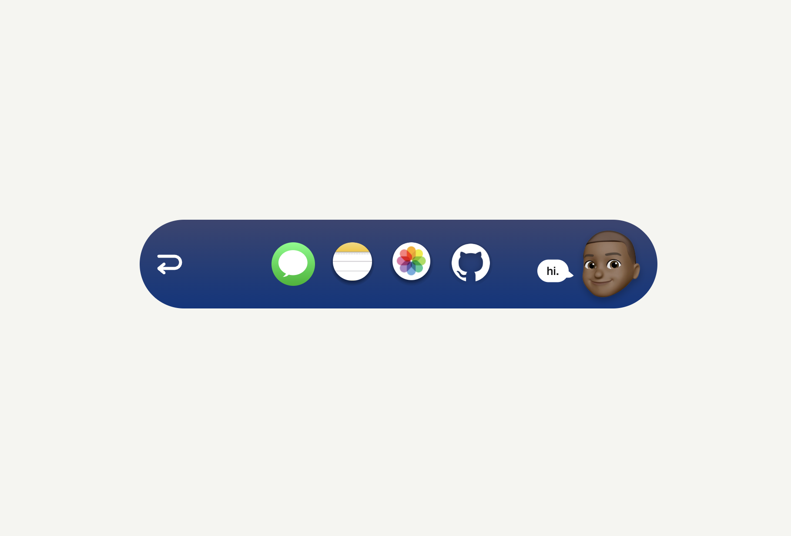
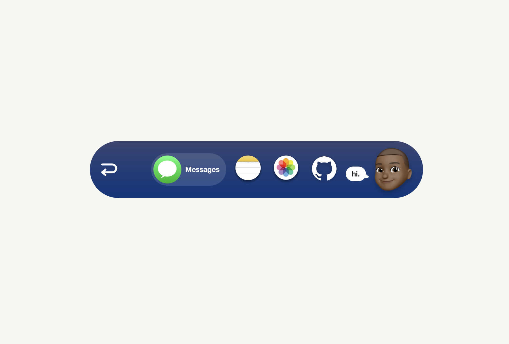
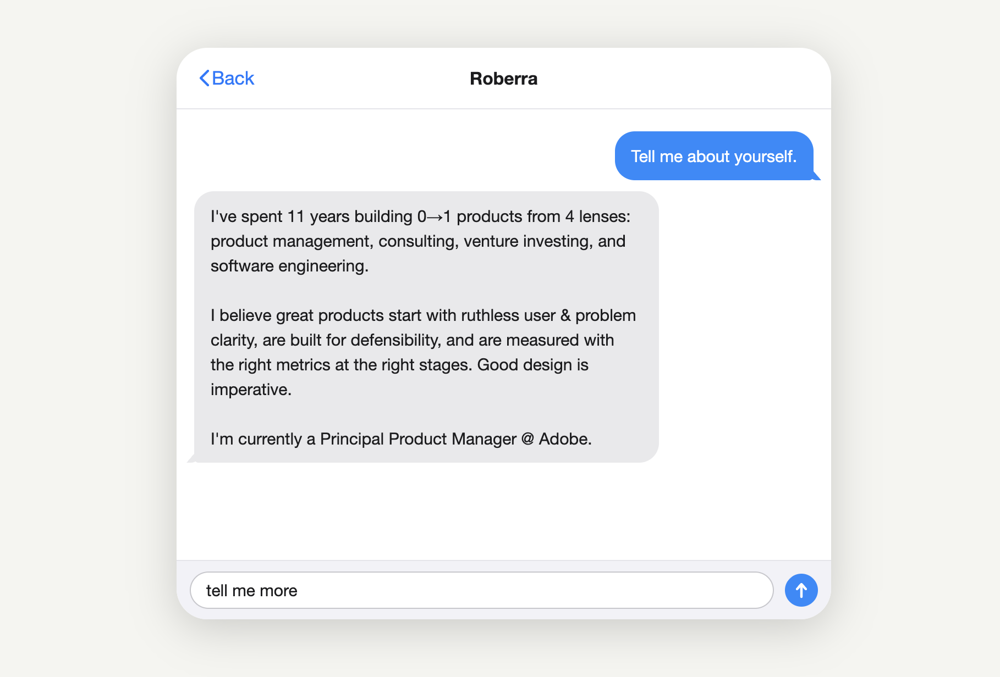
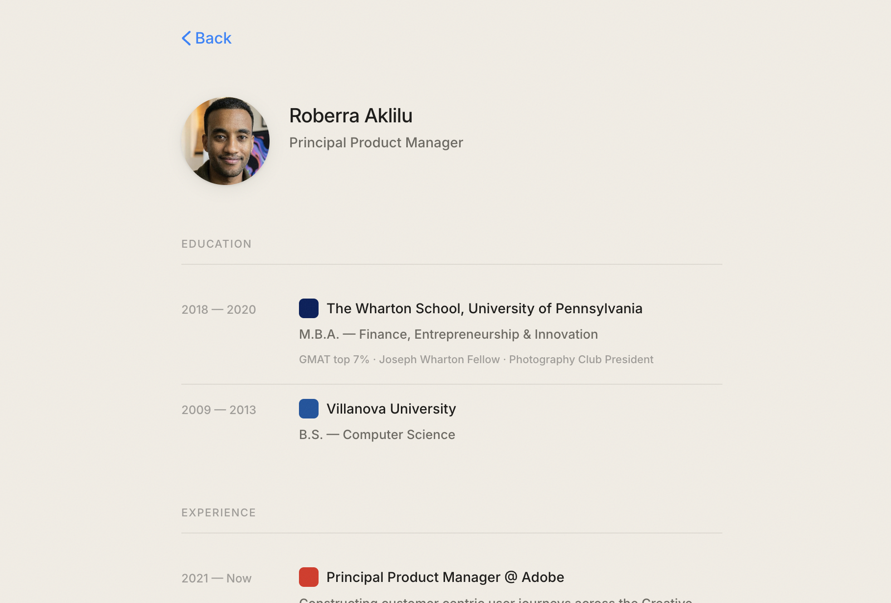

# Interactive iOS Inspired Personal Website Template

HTML, CSS, vanilla JS. No-framework interactive website that feels like a native app. Fork it, swap in your info, and ship it.

---

## Screenshots

**Closed state** — a compact pill with your memoji, name, and a ringing phone button.


**Open state** — tap the phone and the card expands (with motion blur) revealing your links.



**Icon hover expand** — each app icon pill slides open a label on hover. Pure CSS.



**iMessage overlay** — tap Messages to open a scripted conversation introducing yourself.



**CV / Résumé** — grain texture, tight typography, color-coded company badges.



**Photos** — 3-column grid with fullscreen lightbox.


---

## What makes it worth stealing

### Motion-blur card expansion
When you tap the call button, the card doesn't just resize — it squashes, stretches, and blurs horizontally as it expands, then snaps into place. Driven by a custom SVG `feGaussianBlur` filter synced to a `requestAnimationFrame` loop with cubic ease-in-out. Zero libraries.

### Phone that actually rings
The phone icon runs a 5-second CSS keyframe animation that rotates back and forth like a vibrating phone, complete with motion blur at peak shake, then settles — and loops forever. It reads as alive without being annoying.

### Memoji with hidden messages
Click the memoji avatar after the card expands. Click it again. Keep clicking. There are 17 escalating messages ranging from `"whoa."` to `"you're wasting valuable compute"`. Each click triggers a shake animation via a forced reflow trick, and messages auto-fade after 3 seconds.

### iMessage overlay flow
Tap the Messages icon and a full iMessage window slides in. Send two scripted messages that animate in with bubble transitions, then tap anywhere outside to dismiss. The send button locks between phases so you can't spam it.

### App icon hover expand
Each app icon pill expands on hover — the label slides out from `max-width: 0` with a staggered opacity delay. App-store-quality feel, pure CSS.

### CV grain texture
The résumé page has a subtle film grain overlay rendered via an inline SVG `feTurbulence` filter at 5.5% opacity. Tactile without any image assets.

---

## Pages

| Page | File | Description |
|------|------|-------------|
| iMessage Card | `call-card.html` | Fun imessage way to share you're "About me" |
| Resume | `cv.html` | Clean, typographic resume with headshot |
| Photos/Portfolio | `photos.html` | Fullscreen photo grid with lightbox, not into photography? Swap this with your portfolio, or favorite books|

---
## How to use this as your own template

1. **Clone or download** the repo
2. **Replace content** in `call-card.html` or ask your agent to:
   - Swap `icons/memoji.png` with your own memoji or avatar
   - Update the name, email address, and bio text in the iMessage flow
   - Point the app icon links to your own Resume, GitHub, Photos pages
3. **Update `cv.html`** with your work history — the grid handles any number of entries
4. **Drop your photos** into `photos/` and update the array in `photos.html`
5. **Wire up analytics** — GA4 is already plumbed in, just swap your measurement ID
6. **Deploy** — static files, works on GitHub Pages, Netlify, Vercel, or any CDN

No npm install. No build step. Open `call-card.html` in a browser and it works.

---

## Tech

- Vanilla HTML/CSS/JS — no frameworks, no dependencies
- SVG filters for directional blur (`feGaussianBlur`) and film grain (`feTurbulence`)
- `requestAnimationFrame` loops for all card transitions
- [Tailwind CSS CDN](https://tailwindcss.com) — used in `index.html`
- `@dotlottie/player-component` — Lottie animations on the home/about/links buttons
- Google Analytics 4 with active-time tracking

---

## File structure

```
/
├── call-card.html        # Main interactive card (start here)
├── cv.html               # Résumé page
├── photos.html           # Photo gallery
├── headshot.png          # Profile photo used in cv.html
├── icons/
│   ├── memoji.png        # Avatar shown in the card
│   ├── phoneicon.png     # Call button icon
│   ├── notes.svg         # Resume app icon
│   └── photos.svg        # Photos app icon
└── photos/               # Your photo gallery images
```

---

## License

Do whatever you want with it.
